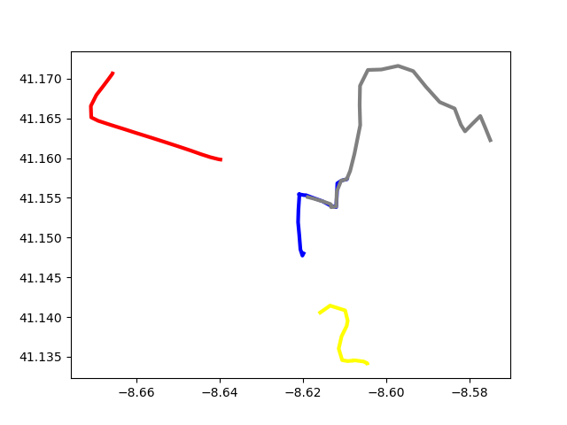
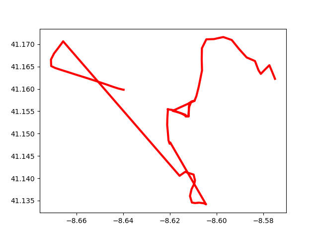

# TASK-3 app数据轨迹绘制

> [python绘图脚本](../cal.py) -finished by xuzijun

所有的app的数据放在dataset文件夹下,一共有四组app的部分数据,使用python绘制出来的结果是

|单独|整合|
|:--:|:--:|
|||

其中整合操作其实就是union的操作,合并不同app的数据,将结果

1. 进入[高德开放平台](https://lbs.amap.com/),注册
2. 我的应用,创建一个新的应用

   

3. 获取安卓密钥

   > 将luzhi改为你的电脑的用户名

   默认的保存位置在 `C:\Users\luzhi\.android`,进入这个目录,输入

   ```bash
   keytool -list -v -keystore C:\Users\luzhi\.android\debug.keystore
   ```

   默认口令是 `android`

   

   记录其中的SHA1

4. 回到我的应用,添加

   > 其中包名是[build.gradle](../app/build.gradle)中的applicationId,本项目是`drz.oddb`

   

5. 进入高德地图的 [Android 地图SDK下载](https://lbs.amap.com/api/android-sdk/download)

   下滑,选择开发包定制下载

   

6. 解压后得到如下文件

   

   在 app下新建文件夹,命名为 `lib`,将最后一个文件复制到该文件夹下

   在Android studio下点击该包,选择`Add as library`

   

   接下来这个包会被展开,得到如下的目录

   

7. 在src下新建文件夹,命名为 `jniLibs`,将刚才解压的SDK那五个文件夹复制到这个目录下面,最后得到如下目录结构

   

8. 恭喜你,不容易,能看到这里,也能做到这里,允许你小摆一会
9. 将如下内容复制到[AndroidManifest.xml](../app/src/main/AndroidManifest.xml),复制在`<manifest>之间</manifest>`

   ```xml
   <!--允许程序打开网络套接字-->
   <uses-permission android:name="android.permission.INTERNET" />
   <!--允许程序设置内置sd卡的写权限-->
   <uses-permission android:name="android.permission.WRITE_EXTERNAL_STORAGE" />
   <!--允许程序获取网络状态-->
   <uses-permission android:name="android.permission.ACCESS_NETWORK_STATE" />
   <!--允许程序访问WiFi网络信息-->
   <uses-permission android:name="android.permission.ACCESS_WIFI_STATE" />
   <!--允许程序读写手机状态和身份-->
   <uses-permission android:name="android.permission.READ_PHONE_STATE" />
   <!--用于进行网络定位-->
   <uses-permission android:name="android.permission.ACCESS_COARSE_LOCATION"></uses-permission>
   <!--用于访问GPS定位-->
   <uses-permission android:name="android.permission.ACCESS_FINE_LOCATION"></uses-permission>
   <!--用于获取wifi的获取权限，wifi信息会用来进行网络定位-->
   <uses-permission android:name="android.permission.CHANGE_WIFI_STATE"></uses-permission>
   <!--用于读取手机当前的状态-->
   <uses-permission android:name="android.permission.READ_PHONE_STATE"></uses-permission>
   <!--用于申请调用A-GPS模块-->
   <uses-permission android:name="android.permission.ACCESS_LOCATION_EXTRA_COMMANDS"></uses-permission>
   ```

   然后在 `<application></application>`中间添加代码

   > 建议添加到最后

   ```xml
    <meta-data android:name="com.amap.api.v2.apikey" android:value="前面获取到的key值">
    </meta-data>
    ```

